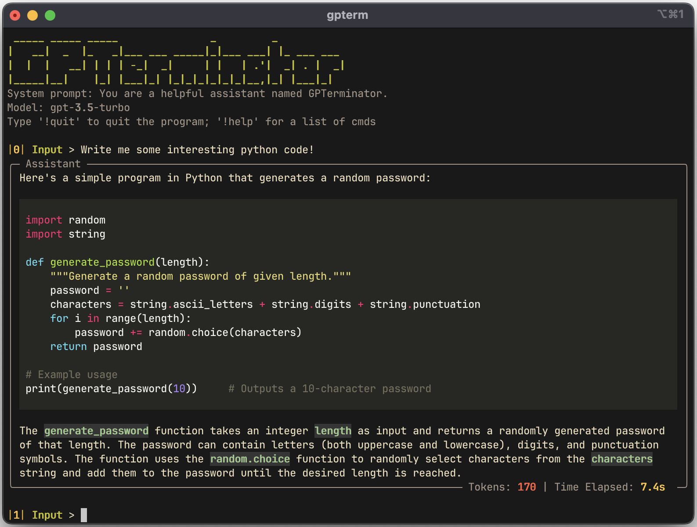

<h1 align="center">GPTerminator :robot: - ChatGPT in the Terminal!</h1>
<p align="center">

</p>
<p align="center">GPTerminator provides a convenient way to interact with OpenAI's chat completion and image generation API's using your command line interface.</p>
<p align="center">


</p>

## Features :sparkles:

- :mag: Chat completion 
- :floppy_disk: Save and load chat sessions 
- :bar_chart: File analysis 
- :art: Image generation with Dalle 
- :clipboard: Easy code and text copying using 
- :repeat: Regeneration of responses

## Getting Started & Installation :rocket:

### To use this terminal interface, follow these steps:

#### 1) Install GPTerminator
```zsh
git clone https://github.com/AineeJames/ChatGPTerminator
pip install .
```
or
```zsh
pip install gpterminator
```
#### 2) Set the OPENAI_API_KEY env variable (you may want this in your .rc file):
```zsh
export OPENAI_API_KEY=PUT_API_KEY_HERE
```
#### 3) Run the following command to start the ChatGPT terminal interface:
```zsh
gpterm
```
#### 4) You can now start chatting. Type a message and press Enter to get a response.
#### 5) Type `!help` for a list of commands to use

## Running with podman/docker (optional) :package:
#### Build the image and provide the `APIKEY`
```bash
podman build \ 
	--build-arg APIKEY=$(echo $OPENAI_API_KEY) \ 
	-t gpterm .
```
#### Run gpterm in the container
```bash
podman run -it --rm --name gpterm gpterm 
```
#### Set an alias for easy access
```bash
echo "alias gpterm='podman run -it --rm --name gpterm gpterm'" >> ~/.bashrc
```

## Commands :exclamation:

- Power up you chat experience with commands!
- By typing `!help` you can view all the possible commands along with a short desctiption.
- Please check out the [wiki](https://github.com/AineeJames/ChatGPTerminator/wiki/Commands) for more detailed help with commands!

## Configuration :gear:

The config.ini directory resides in different locations dependent on your OS. In order to find the path, run GPTerminator and then type `!pconf`.

GPTerminator is configurable and can support multiple configurations. Add the following to your config.ini:

   ```ini
   [CONFIG_TEMPLATE]
   ModelName = 
   SystemMessage = 
   Temperature =
   PresencePenalty = 
   FrequencyPenalty = 
   CommandInitiator = 
   SavePath = 
   ```

- **ModelName:** this is the model used when chatting
- **Temperature** = between 0 and 2
- **PresencePenalty** = between -2 and 2
- **FrequencyPenalty** = between -2 and 2
- **SystemMessage:** this is the starting system message sent to the API
- **CommandInitiator:** this can be set to change the default !<cmd> structure
- **SavePath:** this changes the location of the save path when loading/saving

_Note_: More details on some settings can be found [here](https://platform.openai.com/docs/api-reference/chat/create)

After saving the config file, run: `gpterm`
Then, type !setconf and select which config you wish to use, you can also run the !pconf commang to view the current config details.

_Note_: If you change the CommandInitiator, you will now type <CommandInitiator><cmd> to execute commands...


## Contributing :raised_hands:

### Current Contributors:


<a href="https://github.com/AineeJames/ChatGPTerminator/graphs/contributors">

</a>


We welcome contributions to this project. If you find a bug, have a feature request, or want to contribute code, please open an issue or submit a pull request.

## Disclaimer :warning: 

This program uses the openai API to chat and generate images using dalle. It is a good idea to put a usage cap on your billing, just in case something goes wrong!
