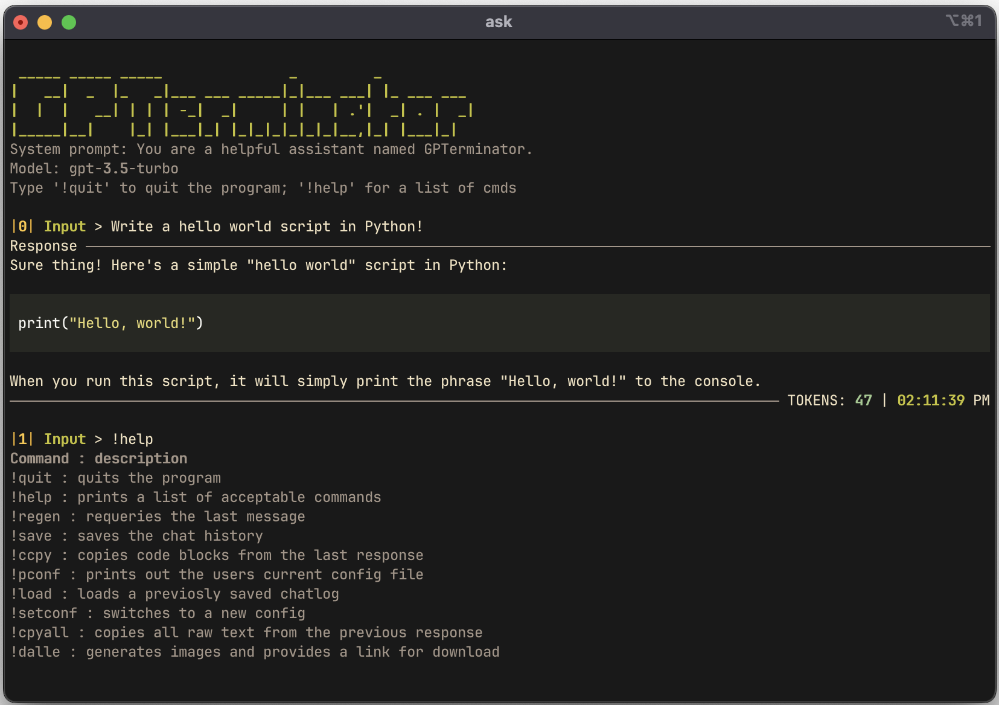

<h1 align="center">GPTerminator :robot:</h1>
<p align="center">

</p>
<p align="center">This terminal interface provides a convenient way to interact with OpenAI's chat completion and image generation API's using your command line interface.</p>
<p align="center">


</p>


## Getting Started :rocket:

To use this terminal interface, follow these steps:

1. Clone this repository to your local machine.
2. Navigate to the cloned directory using your command line interface.
3. Install GPTerminator by using the following command: `pip install .`

4. Set the OPENAI_API_KEY env variable (you may want this in your .rc file): `export OPENAI_API_KEY=PUT_API_KEY_HERE`

5. Run the following command to start the ChatGPT terminal interface: `gpterm`

6. You can now start chatting. Type a message and press Enter to get a response.

7. Type !help for a list of commands to use

<details><summary><h2>Configuration :gear:</h2></summary>


GPTerminator is configurable and can support multiple configurations. Add the following to your config.ini:

   ```ini
   [CONFIG_TEMPLATE]
   ModelName = 
   SystemMessage = 
   Temperature =
   PresencePenalty = 
   FrequencyPenalty = 
   CommandInitiator = 
   SavePath = 
   ```

- **ModelName:** this is the model used when chatting
- **Temperature** = between 0 and 2
- **PresencePenalty** = between -2 and 2
- **FrequencyPenalty** = between -2 and 2
- **SystemMessage:** this is the starting system message sent to the API
- **CommandInitiator:** this can be set to change the default !<cmd> structure
- **SavePath:** this changes the location of the save path when loading/saving

_Note_: More details on some settings can be found [here](https://platform.openai.com/docs/api-reference/chat/create)

After saving the config file, run: `gpterm`
Then, type !setconf and select which config you wish to use, you can also run the !pconf commang to view the current config details.

_Note_: If you change the CommandInitiator, you will now type <CommandInitiator><cmd> to execute commands...


</details>


## Contributing :raised_hands:

We welcome contributions to this project. If you find a bug, have a feature request, or want to contribute code, please open an issue or submit a pull request.

## Disclaimer :warning: 

This program uses the openai API to chat and generate images using dalle. It is a good idea to put a usage cap on your billing, just in case something goes wrong!
